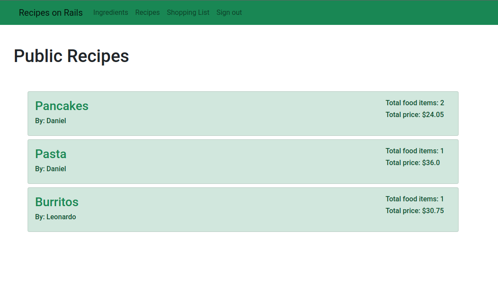

# Recipe App on Rails

> The Recipe app keeps track of all your recipes, ingredients, and inventory.

The Recipe app keeps track of all your recipes, ingredients, and inventory. It allows you to save ingredients, keep track of what you have, create recipes, and generate a shopping list based on what you have and what you are missing from a recipe. Also, since sharing recipes is an important part of cooking the app it allows you to make them public so anyone can access them.

## Built With

- Ruby
- Rails
- Bootstrap
- Rspec

## Getting Started

**This is an example of how you may give instructions on setting up your project locally.**
**Modify this file to match your project, remove sections that don't apply. For example: delete the testing section if the currect project doesn't require testing.**

To get a local copy up and running follow these simple example steps.

### Prerequisites

- Ruby
- Rails
- Yarn
- Postgresql
- Node.js

### Setup

- Clone this repo
- Cd to folder
- Run `bundle install`
- Run `rails db:setup`

### Usage

- To have fast reload enabled, run: `./bin/webpack-dev-server` before starting the server.
- Run `rails s` to start server
- Open `localhost:3000` in your web browser

### Troubleshooting

If you encounter any issues with webpacker, try to run `bundle exec rake webpacker:install`

## Authors

👤 **Daniel Jaramillo**

- GitHub: [@d4nielj](https://github.com/d4nielj)
- Twitter: [@d4niel_jm](https://twitter.com/d4niel_jm)
- LinkedIn: [d4nielj](https://linkedin.com/in/d4nielj)

👤 **Leonardo Dias**

  - GitHub: [@leonardodiasb](https://github.com/leonardodiasb)
  - Twitter: [@BussularDias](https://twitter.com/BussularDias)
  - LinkedIn: [Leonardo Dias Bussular](https://www.linkedin.com/in/leonardo-dias-bussular-a67392178/) 

## 🤝 Contributing

Contributions, issues, and feature requests are welcome!

Feel free to check the [issues page](../../issues/).

## Show your support

Give a ⭐️ if you like this project!

## 📝 License

This project is [MIT](./LICENSE) licensed.
